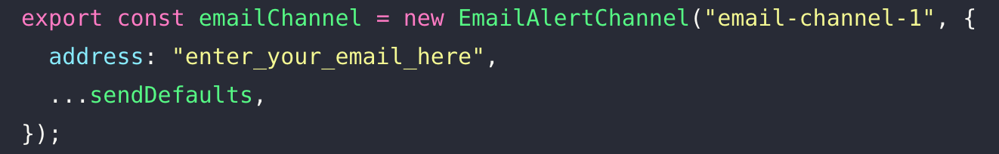
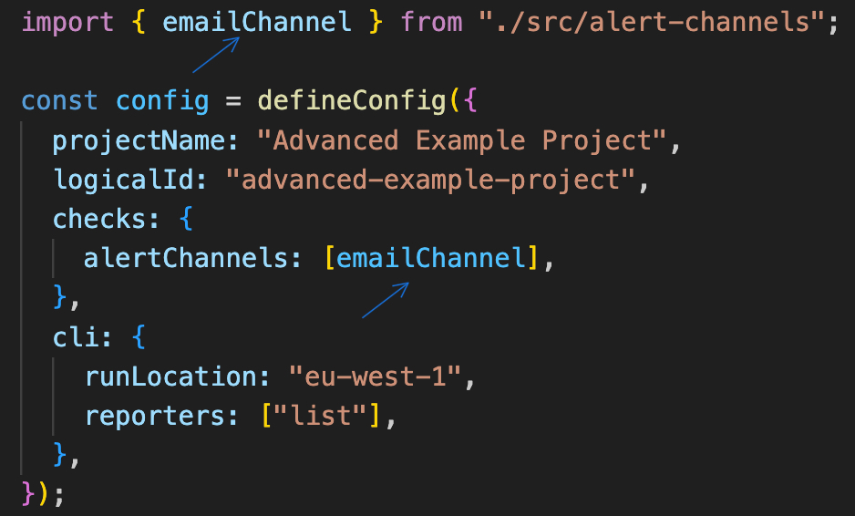
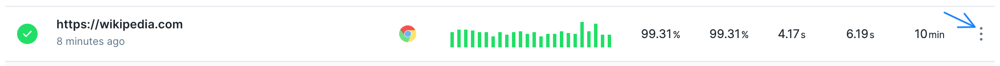
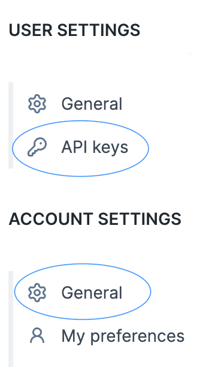

<!-- PROJECT LOGO -->
<br />
<div align="center">
  <a href="https://github.com/github_username/repo_name">
    
  </a>
<h3 align="center">CLI MaC starter files</h3>
  <p align="center">
    <a href="https://www.checklyhq.com/docs/"><strong>Explore the docs »</strong></a>
    <br />
  </p>
</div>

<!-- Details -->

## Details

Starter files to expedite the integration of CLI Monitoring as Code seamlessly into your workflow, facilitating a smooth onboarding process. Pre-equipped with TypeScript and Playwright, selected to ensure a frictionless setup experience. This should empower you to hit the ground running, enabling rapid development and deployment of your monitoring solutions.

<!-- Prereqs -->

## Prerequisites

- <p>Node.js v16.x or higher</p>
- <p>A code editor like Visual Studio Code</p>

<!-- Getting Started -->

## Getting Started

1. Clone the repo
   ```sh
   git clone https://github.com/Dnhem/checkly.git
   ```
1. Install NPM packages
   ```sh
   cd checkly
   npm install
   ```

## 🏃🏻 Rundown of folder and file structure:

### 📁 src

Directory housing Checkly's core directory "\_\_checks\_\_" also contains the "alert-channels.ts" file which holds all the alert constructs.

### 📁 \_\_checks\_\_

The core directory where Checkly detects your test files to run and deploy.

### 📁 playwright

A sub-directory within "\_\_checks\_\_" where you can add and store all your Playwright tests for testing and deployment. You can also add additional directories within "\_\_checks\_\_" to organize your specific checks. As long as the directories and/or files are in the "\_\_checks\_\_" directory, Checkly will be able to detect them. Includes example test files.

### 📁 .github

A "workflow.yml" file provided if you're implementing Github Actions as your CI/CD platform

### 🚨 Setting Alerts

1. The “alert-channels.ts” file configures all of your alert settings. Enter your email address in the “address” property of the “emailChannel” construct.

   

2. The “checkly.config.ts” file is where your core Checkly configuration lives. Import another alert of your choice at the top of this file and add it to the “alertChannels” array to set additional alerts.

   

Voilà, you will now receive alerts to your specified email! If you’d like to set other alerts, simply replace the placeholder values within the “alert-channels.ts” file and repeat step 2.

## 🚛 Exporting checks

If you have existing Playwright checks added on the Checkly platform, let’s go ahead and migrate them to your code base. Head over to the Checkly platform and perform these steps for <b><i>each</i></b> of your checks:

1. Click on the kebab icon (vertical three dots) on the far right side of your check
   

2. Click on “Export to code”. Here you have the option to copy & paste both “check.ts” and “spec.ts” files. You can also download both files and drag and drop them into your “playwright” directory

3. Once the files are inside the “playwright” directory, you can proceed to delete the checks on the Checkly platform to avoid having duplicate checks upon deployment
4. Open up a terminal and navigate to your root project folder and run your test:
   ```shell
   npx checkly test –-record
   ```
5. After validating your checks, deploy them to the Checkly platform:
   ```shell
   npx checkly deploy
   ```
6. Head over to the Checkly platform and refresh the browser. Congrats, your checks are now synced! 🏁

## ♾️ Deploying via CI/CD Pipeline

You can seamlessly integrate Checkly into your CI/CD pipeline. Regardless of the provider or platform, you're going to need to set your `CHECKLY_API_KEY` and `CHECKLY_ACCOUNT_ID` as "secrets" environment variables within those platforms (i.e. GitHub Actions, Jenkins, GitLab).

To access your `CHECKLY_API_KEY` and `CHECKLY_ACCOUNT_ID`, head over to the Checkly platform and click on your avatar on the upper right corner

1. To access your `CHECKLY_API_KEY` - click on "API keys" under USER SETTINGS
2. To access your `CHECKLY_ACCOUNT_ID` - click on "General" under ACCOUNT SETTINGS. Your "Account ID" is directly under your ACCOUNT NAME.



<p></p>

The setup and configuration for each provider or platform are distinctive in their own way. Listed below are Checkly's guides for each one including their respective workflow file examples. <br />
<br />
Checkout Checkly's guides for GitHub Actions, Jenkins, and GitLab: <br />
<br />
[](https://www.checklyhq.com/docs/cicd/github-actions/)&nbsp;&nbsp;&nbsp;
[](https://www.checklyhq.com/docs/cicd/jenkins/)&nbsp;&nbsp;&nbsp;
[](https://www.checklyhq.com/docs/cicd/gitlabci/)
